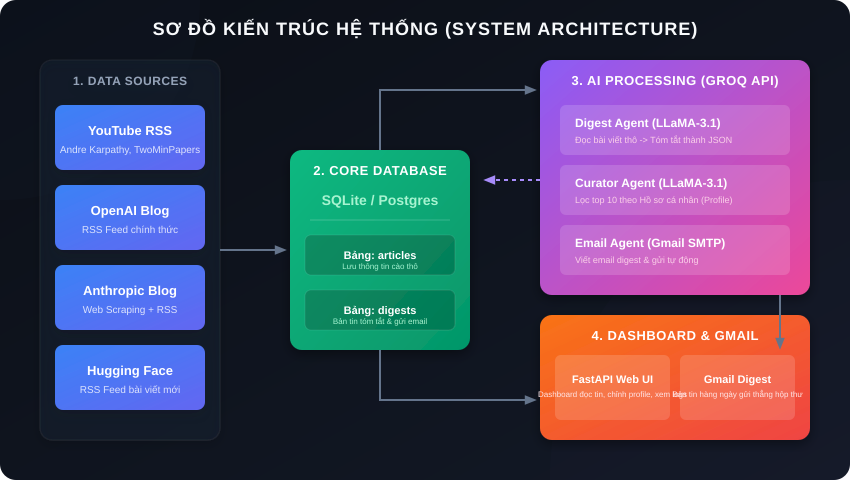
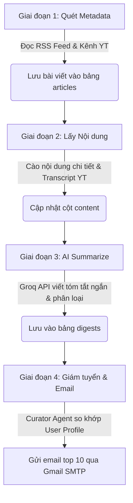

# 🤖 AI News Aggregator — Phiên bản Lập trình viên Sinh viên (100% Miễn phí)

Hệ thống tự động thu thập tin tức công nghệ AI từ nhiều nguồn (YouTube, OpenAI, Anthropic, Hugging Face), sử dụng mô hình LLM qua Groq API để tóm tắt thông minh, tự động lọc nội dung phù hợp với sở thích cá nhân (User Profile) và gửi bản tin tổng hợp (Digest) qua Gmail hàng ngày, đi kèm giao diện Web Dashboard trực quan.

---

## 📊 Sơ đồ kiến trúc hệ thống (System Architecture)

Dưới đây là mô hình hoạt động và luồng dữ liệu của hệ thống, được thiết kế tinh gọn và hiệu quả:



---

## 🛠️ Công nghệ & Tech Stack

Dự án được tối ưu hóa sử dụng toàn bộ các công cụ và dịch vụ **100% miễn phí**, cực kỳ phù hợp cho sinh viên và lập trình viên cá nhân muốn xây dựng sản phẩm AI thực tế với chi phí **$0/tháng**.

| Thành phần | Công nghệ sử dụng | Mục đích & Ưu điểm |
| :--- | :--- | :--- |
| **Ngôn ngữ** | `Python 3.11+` | Ngôn ngữ cốt lõi cho AI & Scraping. |
| **Trình quản lý** | `uv` | Trình quản lý package siêu tốc, nhanh hơn pip nhiều lần. |
| **Web Server** | `FastAPI` & `Uvicorn` | API server nhẹ, tốc độ cao để chạy Dashboard. |
| **Giao diện (UI)** | `Jinja2`, `HTML5` & `Vanilla CSS` | Giao diện Dark/Light Mode hiện đại, hiệu ứng Glassmorphism. |
| **Cơ sở dữ liệu** | `SQLAlchemy` (ORM) & `SQLite` / `PostgreSQL` | Local lưu trữ trong file `news.db` dạng SQLite, Production chạy PostgreSQL. |
| **Bộ xử lý LLM** | `Groq API` (Model: `llama-3.1-8b-instant`) | Hỗ trợ 14,400 lượt gọi/ngày miễn phí, tốc độ phản hồi cực nhanh. |
| **Thu thập dữ liệu** | `feedparser`, `requests`, `html-to-markdown` | Quét dữ liệu RSS sạch từ các blog OpenAI, Anthropic, Hugging Face. |
| **YouTube Transcript**| `youtube-transcript-api` | Lấy trực tiếp phụ đề video YouTube không cần API Key chính thức. |
| **Giao tiếp Email** | `smtplib` & `email.mime` | Gửi email digest bằng cơ chế Gmail SMTP + App Password. |
| **Triển khai Cloud** | `Render Free Tier` | Tự động chạy ngầm gửi email vào 14h hàng ngày (Cron Job) & Web Dashboard. |

---

## 🔄 Cơ chế hoạt động (Pipeline Workflow)

Khi chạy, hệ thống sẽ thực hiện tuần tự qua 4 giai đoạn chính trong tệp [runner.py](file:///c:/Users/ADMIN/Desktop/ai-news-aggregator/app/runner.py):



1. **Giai đoạn 1: Thu thập metadata**: Quét các RSS feed đã cấu hình trong registry (YouTube, OpenAI, Anthropic, Hugging Face). Lưu tiêu đề, tác giả, đường dẫn vào bảng `articles` nếu chưa tồn tại.
2. **Giai đoạn 2: Lấy nội dung chi tiết**: Lấy transcript đầy đủ cho video YouTube hoặc cào mã HTML nội dung bài viết gốc chuyển đổi sang định dạng Markdown.
3. **Giai đoạn 3: Tóm tắt bằng AI**: Gửi nội dung chi tiết đến Groq API (LLaMA 3.1) để tóm tắt thành 2-3 câu ngắn gọn kèm phân loại thể loại (`Research`, `Product`, `Tutorial`, `News`) dưới dạng cấu trúc JSON, lưu vào bảng `digests`.
4. **Giai đoạn 4: Giám tuyển & Gửi email**: Đọc thông tin sở thích học tập của bạn (User Profile) để Curator Agent xếp hạng chọn ra tối đa 10 tin phù hợp nhất, đóng gói thành email định dạng Markdown/Text gửi về hộp thư cá nhân.

---

## ⚙️ Cấu hình và Cài đặt Local

### 1. Chuẩn bị biến môi trường
Tạo tệp `.env` tại thư mục gốc của dự án:
```env
GROQ_API_KEY=gsk_...             # Đăng ký miễn phí tại console.groq.com
GMAIL_ADDRESS=your_email@gmail.com
GMAIL_APP_PASSWORD=xxxx xxxx xxxx xxxx  # Mật khẩu ứng dụng Gmail (Bật 2-Step Verification)
DATABASE_URL=sqlite:///news.db  # Kết nối mặc định SQLite tại local
```

### 2. Cài đặt thư viện & Khởi chạy

Dự án sử dụng trình quản lý `uv` nên bạn không cần cài thủ công bằng pip. Hãy chạy các lệnh sau tại terminal:

* **Bước 1 — Khởi tạo cấu trúc Database**:
  ```bash
  uv run python init_db.py
  ```
  *(Tự động tạo tệp `news.db` và thiết lập các bảng `articles`, `digests`)*.

* **Bước 2 — Chạy thử nghiệm cào tin & gửi email (Pipeline)**:
  ```bash
  uv run python main.py
  ```

* **Bước 3 — Khởi động Web Dashboard**:
  ```bash
  uv run python start_web.py
  ```
  Truy cập ngay **[http://127.0.0.1:8000](http://127.0.0.1:8000)** trên trình duyệt để đọc tin tức, đổi giao diện sáng/tối, chỉnh sửa profile và theo dõi log chạy pipeline thời gian thực.

---

## ☁️ Triển khai lên Cloud (Render Free Tier)

Dự án đã được cấu hình sẵn tệp [render.yaml](file:///c:/Users/ADMIN/Desktop/ai-news-aggregator/render.yaml) để tự động hóa hoàn toàn quá trình triển khai:

1. Đẩy mã nguồn lên một Repository GitHub của bạn.
2. Đăng nhập vào **Render.com** -> Bấm **New** -> **Blueprint**.
3. Chọn repo `ai-news-aggregator`. Render sẽ tự động cấu hình:
   * **Database (PostgreSQL)** để chạy production.
   * **Cron Job** tự động thức giấc cào tin và gửi email cho bạn vào **14:00 giờ Việt Nam (7:00 UTC)** mỗi ngày.
   * **Web Service** chạy ứng dụng FastAPI Dashboard để bạn truy cập từ internet.
4. Thêm các biến môi trường `GROQ_API_KEY`, `GMAIL_ADDRESS`, và `GMAIL_APP_PASSWORD` vào mục Environment trên Dashboard của Render.